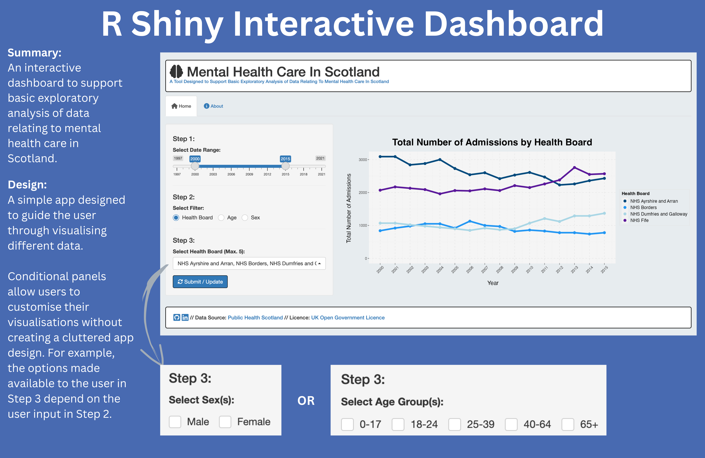

# Mental Health Care In Scotland: Dashboard

------------------------------------------------------------------------

------------------------------------------------------------------------

## Introduction

This project is made up of an interactive dashboard supporting basic exploratory analysis of data relating to mental health care in Scotland.

------------------------------------------------------------------------

## Aim/Purpose

The app has been created for learning purposes only. I developed the initial version during my free time while completing the CodeClan Professional Data Analysis Course. It serves as a tool for personal development and to demonstrate relevant data analysis skills.

------------------------------------------------------------------------

## Data Sources

*Downloaded May & June 2023*

Public Head Scotland: Mental Health Inpatient Activity

-   Link: <https://www.opendata.nhs.scot/dataset/mental-health-inpatient-activity>
-   License: [UK Open Government Licence (OGL)](https://www.nationalarchives.gov.uk/doc/open-government-licence/version/3/)

All figures displayed are a combined total of *SMR01* and *SMR04* entries. For more information on how these records are compiled, please see the PHS publication on 'Mental Health Inpatient Activity', [here](https://publichealthscotland.scot/publications/mental-health-inpatient-activity/mental-health-inpatient-activity-28-march-2023/data-summary/).

------------------------------------------------------------------------

## Key Skills

-   Data Cleaning
-   Data Wrangling
-   Exploratory Data Analysis
-   Data Visualisation
-   Dashboard Development

------------------------------------------------------------------------

## Languages/Tools Used

#### Languages

-   R
-   RShiny
-   HTML
-   CSS
-   Regex
-   R Markdown

#### R Packages

-   tidyverse
-   janitor
-   testthat
-   here

#### Software/Technologies

-   RStudio
-   Git
-   Github

------------------------------------------------------------------------

## Areas for Future Development

This project remains a work in progress and there are a number of additional features planned. A selection of these have been provided below:

-   The addition of an insights tab highlighting key insights derived from the data.
-   The option for users to output data as a data table using `gt tables`.
-   The ability to edit plot display settings.
-   The addition of validation to display an instructional message in the `mainPanel()` prior to the user submitting their initial inputs.

------------------------------------------------------------------------
